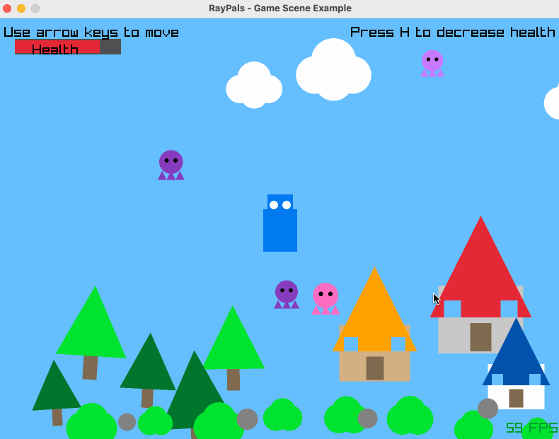
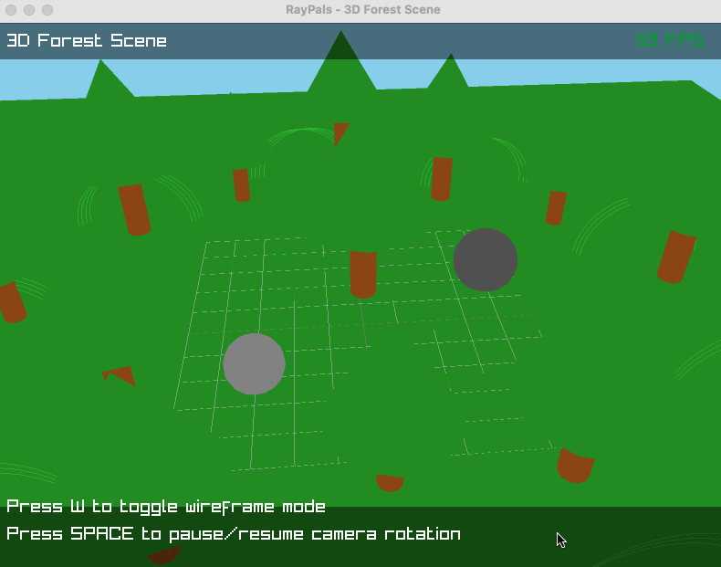
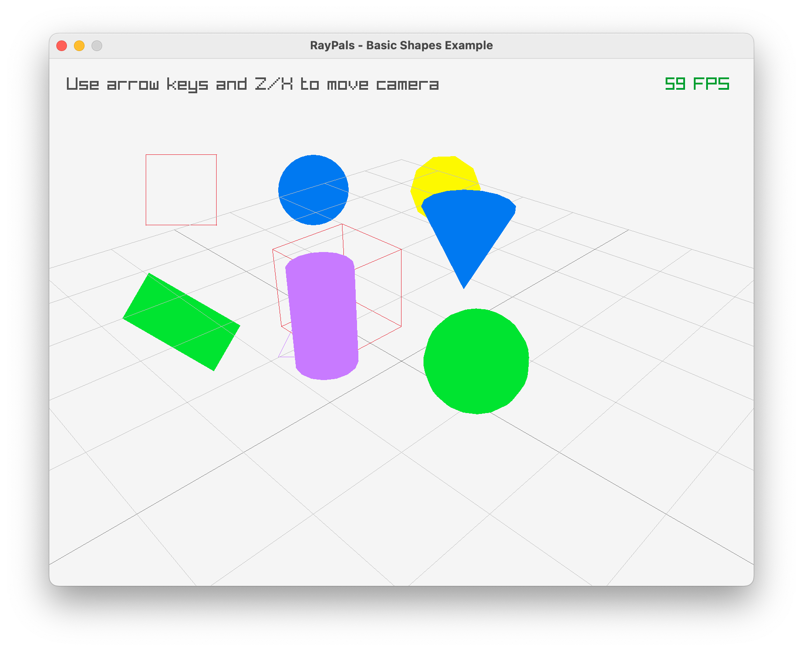
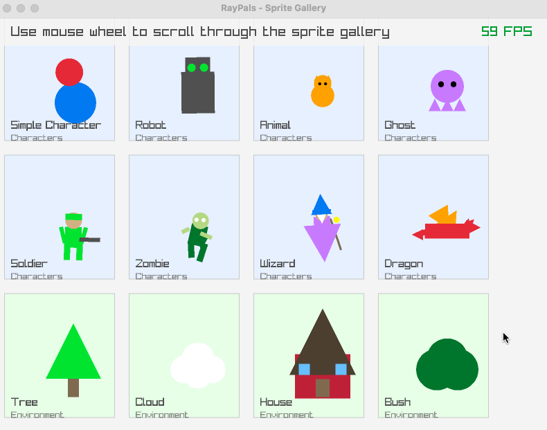

# RayPals

RayPals is a simple 2D/3D shape and sprite library built on top of raylib. It provides an easy-to-use interface for creating and manipulating shapes, sprites, and 3D objects for game development.






## Features

- **Basic 2D Shapes**
  - Square
  - Rectangle
  - Circle
  - Triangle
  - Star
  - Polygon
  - Arrow

- **Basic 3D Shapes**
  - Cube
  - Sphere
  - Cone
  - Cylinder

- **3D Models/Sprites**
  - Tree (trunk and foliage)
  - Robot (body, head, arms, and eyes)
  - Spaceship (body, wings, cockpit, engines)
  - More coming soon!

- **Sprite System**
  - Combine multiple shapes into sprites
  - Built-in sprite transformations (position, rotation, scale)
  - Animation support
  - Extensive collection of pre-built sprites

- **Pre-built Sprites**
  - Characters (Simple Character, Robot, Animal, Ghost, etc.)
  - Environment Objects (Tree, Cloud, House, Bush, Rock, etc.)
  - Vehicles (Car, Tank, Motorcycle, Airplane, UFO, etc.)
  - Items (Sword, Shield, Potion, Treasure Chest, etc.)
  - Magic Effects (Star, Lightning, Portal, Explosion)
  - UI Elements (Button, Health Bar)

- **Animation Support**
  - Scale animations
  - Rotation animations
  - Color transitions
  - Custom animation properties

## Installation

1. Make sure you have raylib installed on your system
2. Clone this repository:
   ```bash
   git clone https://github.com/yourusername/raypals.git
   ```
3. Build using CMake:
   ```bash
   mkdir build
   cd build
   cmake ..
   cmake --build .
   ```

## Usage Examples

### Creating a Simple 2D Shape

```c
#include "raypals.h"

// Create a red square
RayPals2DShape* square = CreateSquare(
    (Vector2){ 100, 100 },  // position
    50,                     // size
    RED                     // color
);

// Draw the shape
Draw2DShape(square);

// Don't forget to free when done
FreeShape(square);
```

### Creating a Sprite

```c
#include "raypals.h"

// Create a character sprite
RayPalsSprite* character = CreateSimpleCharacter(
    (Vector2){ 400, 300 },  // position
    60,                     // size
    BLUE,                   // body color
    RED                     // head color
);

// Draw the sprite
DrawSprite(character);

// Free resources when done
FreeSprite(character);
```

### Creating and Manipulating 3D Models

```c
#include "raypals.h"

// Create a 3D tree
RayPals3DTree tree = Create3DTree(
    (Vector3){ 0.0f, 0.0f, 0.0f },  // position
    1.0f,                           // scale
    BROWN,                          // trunk color
    DARKGREEN                       // leaves color
);

// Create a 3D robot
RayPals3DSprite* robot = Create3DRobot(
    (Vector3){ 2.0f, 0.0f, 0.0f },  // position
    1.0f,                           // scale
    DARKGRAY,                       // body color
    GREEN                           // detail color
);

// Create a 3D spaceship
RayPals3DSprite* spaceship = Create3DSpaceship(
    (Vector3){ -2.0f, 2.0f, 0.0f }, // position
    1.0f,                           // scale
    LIGHTGRAY,                      // body color
    SKYBLUE                         // glass color
);

// All 3D models can be easily rotated and animated
Vector3 rotation = { 0.0f, animTime * 30.0f, 0.0f };  // Rotate around Y axis
Set3DSpriteRotation(tree.sprite, rotation);
Set3DSpriteRotation(robot, rotation);
Set3DSpriteRotation(spaceship, rotation);

// Draw all 3D models with the standard 3D sprite drawing function
Draw3DSprite(tree.sprite, camera);
Draw3DSprite(robot, camera);
Draw3DSprite(spaceship, camera);

// Free resources when done
Free3DTree(&tree);
Free3DSprite(robot);
Free3DSprite(spaceship);
```

This approach integrates all 3D models with the standard sprite system. The `Draw3DSprite` function handles all 3D transformations and drawing, providing a unified interface for all 3D objects.

## Examples

The repository includes several example programs demonstrating different features:

- `basic_shapes.c`: Demonstrates basic 2D shape creation and manipulation
- `shape_animation.c`: Shows how to animate shapes
- `sprite_example.c`: Basic sprite usage
- `sprite_gallery.c`: Showcases all available sprites and 3D models
- `3d_sprites_example.c`: Demonstrates 3D forest scene creation and rendering
- `3d_robot_example.c`: Shows how to create, manipulate, and animate 3D robots
- `game_scene.c`: Shows how to create a simple game scene

Run the examples from the build directory:
```bash
./examples/sprite_gallery
./examples/3d_sprites_example
./examples/3d_robot_example
```

## Tests

The project includes a test suite to verify the functionality of key components:

- 2D shape creation and manipulation
- Sprite creation and composition
- Animation support
- 3D robot creation and manipulation

Run the tests with:
```bash
mkdir build && cd build
cmake .. -DBUILD_TESTS=ON
cmake --build .
ctest
```

## Documentation

For detailed API documentation, see the header file `include/raypals.h`. Each function and structure is documented with clear descriptions and usage information.

## License

This project is licensed under the MIT License - see the LICENSE file for details.

## Contributing

Contributions are welcome! Please feel free to submit a Pull Request.

See the CONTRIBUTING.md file for more details on how to contribute to the project.

## Acknowledgments

- Built on top of [raylib](https://www.raylib.com/)
- Inspired by the need for simple, reusable game development components
